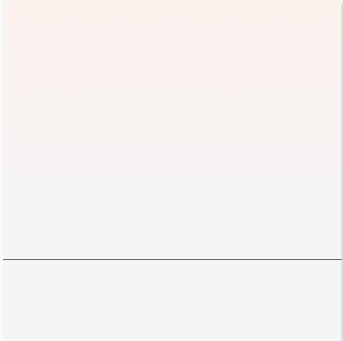
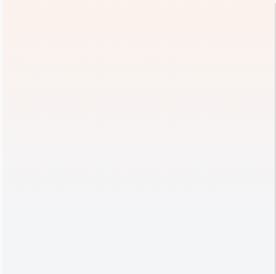

# 设置渐变背景色相关

### 1、部分浏览器会有黑色边线

css 配置：

```css
.bg-fixed.fail[data-v-0cf504b7] {
  height: 15.06rem;
  position: fixed;
  top: 0;
  left: 0;
  right: 0;
  z-index: 0;
  background: -webkit-gradient(
      linear,
      left bottom,
      left top,
      color-stop(-5%, #f4f5f7),
      to(#fbf2ed)
    ) 100%;
  background: linear-gradient(0deg, #f4f5f7 -5%, #fbf2ed 100%) 100%;
}
```

前端展示：\


**解决**：设置 no-repeat 可解决

```css
background-repeat: no-repeat;
```
前端展示：\
