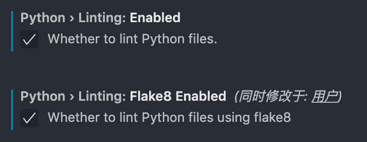
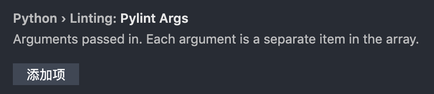
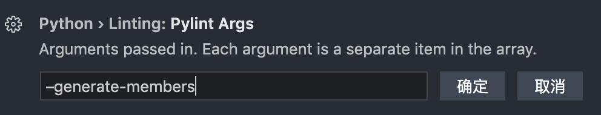

# 问题汇总

#### 1. `import this`
	
在python的交互环境下输入import this，会出现一篇名为《The Zen of Python》（Python之禅）
	
#### 2. `AttributeError: module 'turtle' has no attribute 'pensize'`

原因：新建的py文件的名称不能与模块名称重复，改为其他名称就可以了
	
#### 3. `Module 'turtle' has no 'goto' member`
	
安装pylint做语法检查，但在引入模块时，会提示模块无成员

**原因**：pylint是vscode的python语法检查器，pylint是静态检查，在用第三方库的时候有些成员只有在运行代码的时候才会被建立，它就找不到成员

**解决**：
	
（1）建议改使用Flake8，以vscode for mac为例，

    a. 【cmd+shift+P】，运行select linter，选择flake8，或者【cmd+，】打开设置界面，搜索lintenable，勾选下边的两项
		
  

    b. 如果vs提示没有安装flake8，则可 1、点击提示框中的install安装；2、终端运行 pip install -U flake8 --user 
	
（2）如果想继续使用pylint，可以同样【cmd+,】打开设置界面，搜索lintargs，在下边的位置，点击「添加项」，然后在输入框中输入字符串【-generate-members】，确定即可 
	

	
	
> 总结：建议在设置界面中修改，而不是在setting.json中修改，之前有过因修改的格式或内容错误导致vscode打不开。。。后清除所有setting和config重置配置才解决的。

#### 4. 使用 `random.shuffle` 时提示 `TypeError: object of type 'generator' has no len()`

`random.shuffle`只能接收`list`类型的参数，而不是`generator`

