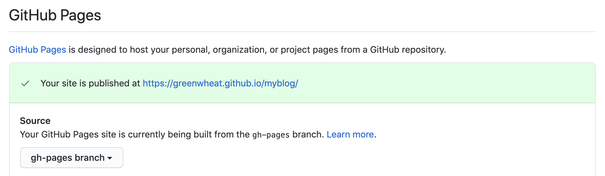
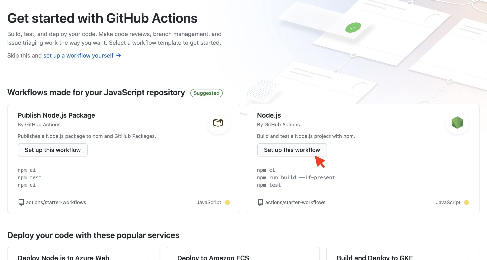

# 使用 `Gitbook` 和 `github-pages` 构建博客

### 希望达到的效果

- 目录文件`SUMMARY.md`能自动生成
- md 文件更新交上传仓库 master 分支后，能自动编译部署到 gh-pages 分支
- 主题自定义优化

### 自动生成目录结构并写入`SUMMARY.md`

#### 生成目录

```javascript
function getDirMap(filepath, depth = 0) {
  let result = {};

  result.path = filepath;
  result.name = path.basename(filepath);
  // 目录的层级深度
  result.depth = depth;

  const stats = fs.statSync(filepath);

  if (stats.isFile()) {
    result.type = "file";
    return result;
  }

  // 子文件夹需要递归遍历
  result.type = "directory";
  const dirs = fs.readdirSync(filepath);

  // 排除一些不需要生成目录的文件和文件夹
  dirs = dirs.filter(
    dir =>
      [".DS_Store", "_book", "SUMMARY.md", "assets"].indexOf(
        path.basename(dir)
      ) < 0
  );

  result.children = dirs.map(dir => {
    return getDirMap(path.join(filepath, dir), depth + 1);
  });

  return result;
}

let dirMap = {};
dirMap = getDirMap("doc");

console.log(JSON.stringify(dirMap));
```

来试验下结果：

```base
  node config/summary-generate.js
```

<details>
  <summary>打印结果如下（点击展开）:</summary>

```json
{
  "path": "doc",
  "name": "doc",
  "depth": 0,
  "type": "directory",
  "children": [
    {
      "path": "doc/01-JavaScript基础（ES5、ES6）",
      "name": "01-JavaScript基础（ES5、ES6）",
      "depth": 1,
      "type": "directory",
      "children": [
        {
          "path": "doc/01-JavaScript基础（ES5、ES6）/Array.md",
          "name": "Array.md",
          "depth": 2,
          "type": "file"
        },
        {
          "path": "doc/01-JavaScript基础（ES5、ES6）/继承、封装、多态.md",
          "name": "继承、封装、多态.md",
          "depth": 2,
          "type": "file"
        },
        {
          "path": "doc/01-JavaScript基础（ES5、ES6）/预解释、作用域、闭包、this.md",
          "name": "预解释、作用域、闭包、this.md",
          "depth": 2,
          "type": "file"
        }
      ]
    },
    {
      "path": "doc/02-TypeScript",
      "name": "02-TypeScript",
      "depth": 1,
      "type": "directory",
      "children": [
        {
          "path": "doc/02-TypeScript/基本语法.md",
          "name": "基本语法.md",
          "depth": 2,
          "type": "file"
        }
      ]
    },
    {
      "path": "doc/03-Node",
      "name": "03-Node",
      "depth": 1,
      "type": "directory",
      "children": [
        {
          "path": "doc/03-Node/fs.md",
          "name": "fs.md",
          "depth": 2,
          "type": "file"
        },
        {
          "path": "doc/03-Node/path.md",
          "name": "path.md",
          "depth": 2,
          "type": "file"
        },
        {
          "path": "doc/03-Node/语义版本控制.md",
          "name": "语义版本控制.md",
          "depth": 2,
          "type": "file"
        }
      ]
    },
    {
      "path": "doc/04-工程化实践",
      "name": "04-工程化实践",
      "depth": 1,
      "type": "directory",
      "children": [
        {
          "path": "doc/04-工程化实践/3个环境.md",
          "name": "3个环境.md",
          "depth": 2,
          "type": "file"
        },
        {
          "path": "doc/04-工程化实践/Git.md",
          "name": "Git.md",
          "depth": 2,
          "type": "file"
        },
        {
          "path": "doc/04-工程化实践/Linux.md",
          "name": "Linux.md",
          "depth": 2,
          "type": "file"
        },
        {
          "path": "doc/04-工程化实践/docker.md",
          "name": "docker.md",
          "depth": 2,
          "type": "file"
        }
      ]
    },
    {
      "path": "doc/05-技术广度",
      "name": "05-技术广度",
      "depth": 1,
      "type": "directory",
      "children": [
        {
          "path": "doc/05-技术广度/ruby.md",
          "name": "ruby.md",
          "depth": 2,
          "type": "file"
        }
      ]
    },
    {
      "path": "doc/06-前端工具类",
      "name": "06-前端工具类",
      "depth": 1,
      "type": "directory",
      "children": [
        {
          "path": "doc/06-前端工具类/Mac相关.md",
          "name": "Mac相关.md",
          "depth": 2,
          "type": "file"
        },
        {
          "path": "doc/06-前端工具类/VSCode.md",
          "name": "VSCode.md",
          "depth": 2,
          "type": "file"
        },
        {
          "path": "doc/06-前端工具类/静态页面and文档生成工具.md",
          "name": "静态页面and文档生成工具.md",
          "depth": 2,
          "type": "file"
        }
      ]
    },
    {
      "path": "doc/07-笔记",
      "name": "07-笔记",
      "depth": 1,
      "type": "directory",
      "children": [
        {
          "path": "doc/07-笔记/使用Gitbook和github-pages构建博客.md",
          "name": "使用Gitbook和github-pages构建博客.md",
          "depth": 2,
          "type": "file"
        },
        {
          "path": "doc/07-笔记/如何把json数据转化为demo.json并下载文件.md",
          "name": "如何把json数据转化为demo.json并下载文件.md",
          "depth": 2,
          "type": "file"
        }
      ]
    },
    { "path": "doc/README.md", "name": "README.md", "depth": 1, "type": "file" }
  ]
}
```

</details>

#### 写入`SUMMARY.md`

根据`SUMMARY.md`的结构，写入就是递归遍历生成的目录即可，层次结构中的缩进可以通过`" ".repeat(+(depth - 1))`计算缩进量。

```javascript
if (type === "directory") {
  result = `${"  ".repeat(+(depth - 1))}* ${title}`;
} else if (type === "file") {
  result = `${"  ".repeat(+(depth - 1))}* [${title}](./${path.replace(
    /\bdoc\//,
    ""
  )})`;
}
```

### 使用 `github` 的 `Actions` 实现 `gh-pages` 自动发布

#### 实现目标：

- `master`分支存放开发代码和 md 文件；`gh-pages`分支存放编译后的 html 文件；
- 通过`gh-pages`发布博客；
- 希望在`master`分支代码有更新（例如`push`、`pull-request`等）时，可以自动编译并将结果推送到`gh-pages`分支上；

#### `gh-pages`分支

新建`gh-pages`分支，并将其设置为`github-pages`的默认分支(位置：Setting -> Options -> GitHub Pages)；



#### 设置`Actions`

`Actions` 是 `github` 提供的`CI/CD`（Continuous Integration/Continuous Deployment，持续集成/持续交代、部署）功能。一个.yml文件对应一条workflow，一条workflow中包含多个job，一个job里可以有多个step，一个step中可以配置多个action。`github` 有很多公开共享的 `action`，很方便快速上手。

点击仓库的`Action`面板，选择一种默认带部署环境的workflow，也可以手动创建新的。这里我选择了推荐的node的。



<details>
  <summary>.yml示例（点击展开）</summary>

<pre><code>
# This workflow will do a clean install of node dependencies, build the source code and run tests across different versions of node
# For more information see: https://help.github.com/actions/language-and-framework-guides/using-nodejs-with-github-actions

name: Node.js CI

on:
  push:
    branches: [master]
  pull_request:
    branches: [master]

jobs:
  build:
    runs-on: ubuntu-latest

    strategy:
      matrix:
        node-version: [10.x]

    steps:
      - uses: actions/checkout@v2
      - name: Use Node.js ${{ matrix.node-version }}
        uses: actions/setup-node@v1
        with:
          node-version: ${{ matrix.node-version }}
      - run: |
          npm install
          npm install -g gitbook-cli
          node config/summary-generate.js
          gitbook build doc _book
      - name: Deploy to GitHub Pages
        if: success()
        uses: crazy-max/ghaction-github-pages@v2
        with:
          target_branch: gh-pages
          build_dir: _book
        env:
          GITHUB_TOKEN: ${{ secrets.MYBLOG_PUSH_BUILD }}

</code></pre>

</details>
