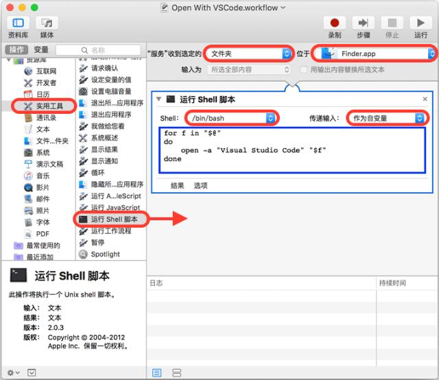
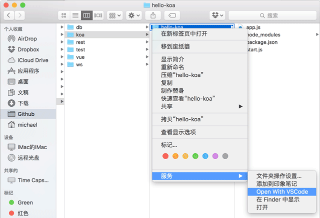
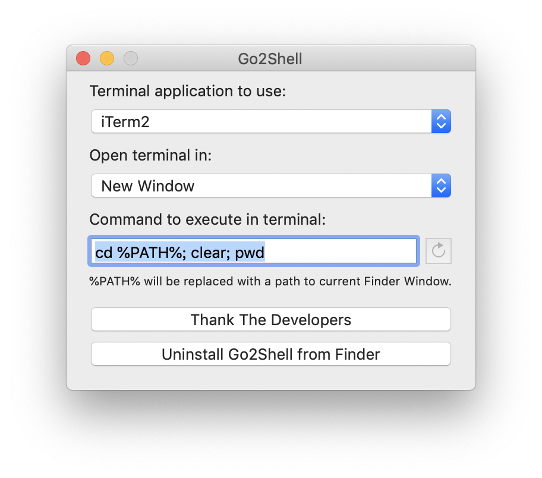

# Mac 相关

#### 1. Mac系统中 mdworker、mds、mds_stores进程占领CPU
    
这几个进程都是为了Spotlight索引而疯狂的，解决方案：

```bash
    sudo mdutil -a -i off
```

打开
```bash
    sudo mdutil -a -i on
```


#### 2. Mac解决文件名大小写不敏感

>方案：创建新的磁盘分区，设置新分区格式为 **「Mac OS 扩展（区分大小写，日志式）」** 。

#### 3. 使用「Automator（自动操作）」添加Finder右键「通过code打开」命令

- 先运行Automator，选择“服务”：


- 然后，执行以下操作：



   > a. 在右侧面板选择“服务”收到选定的“文件夹”，位于“Finder.app“，该选项是为了从Finder中接收一个文件夹；<br>
   > b. 在左侧面板选择”实用工具“，然后找到”运行Shell脚本“，把它拽到右侧面板里；<br>
   > c. 在右侧”运行Shell脚本“的面板里，选择Shell”/bin/bash“，传递输入“作为自变量”，然后修改Shell脚本如下：
```shell
  for f in "$@"
  do  
    open -a "Visual Studio Code" "\$f"  
  done  
```
- 保存为“Open With VSCode”后，打开 Finder，选中一个文件夹，点击右键，“服务”，就可以看到“Open With VSCode”菜单：




#### 4. 在当前目录启动shell窗口的工具：Go2Shell

链接:https://pan.baidu.com/s/1p0u0srcq251uQrMugWPUxw  
密码:bkkv

